# Mockups Desktop

Referencia visual para la version de escritorio de la app local de rutinas.
Las pantallas usan una estructura de navegador PC con sidebar, area principal y panel contextual cuando aporta valor.

## Criterio general

- Interfaz minimalista, sin landing page.
- La app abre directo en una herramienta usable.
- En desktop se aprovecha el ancho con tablas, paneles laterales y vista previa.
- En mobile estos mismos flujos deben compactarse a navegacion por pestañas o pantallas sucesivas.

## Mosaico

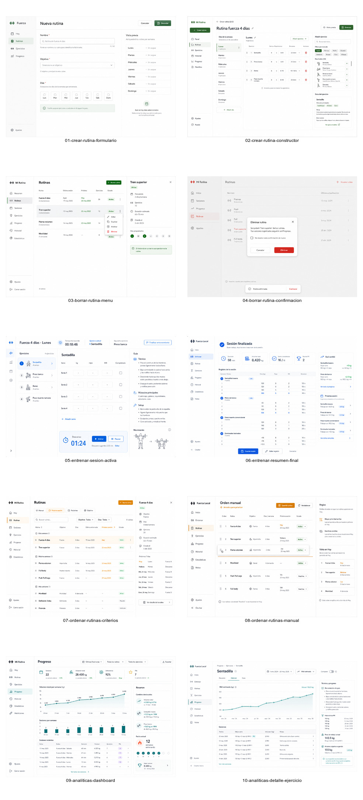

## Flujos

### Crear rutina

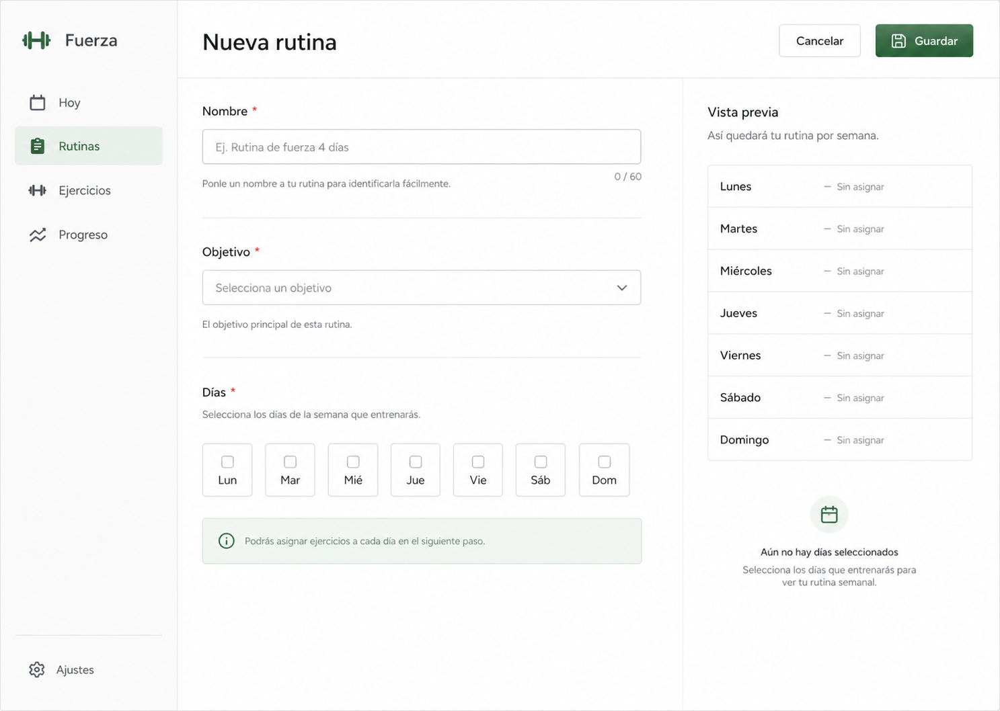

Estado inicial para crear una rutina. El usuario define nombre, objetivo y dias. La pagina responde mostrando una vista previa semanal antes de guardar.

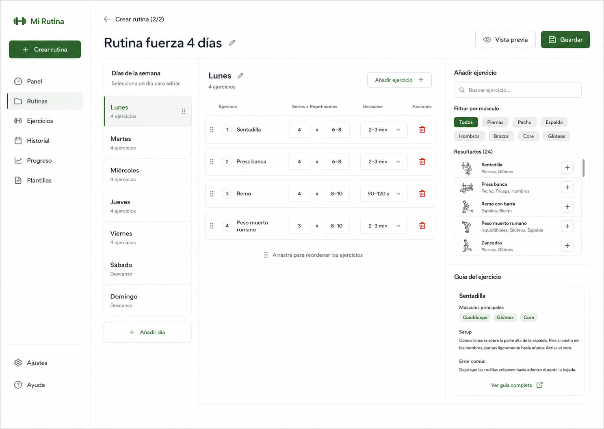

Constructor de rutina. El usuario selecciona un dia, agrega ejercicios y ajusta series, repeticiones y descansos. La pagina mantiene a la derecha el buscador de ejercicios y una guia tecnica compacta.

### Borrar rutina

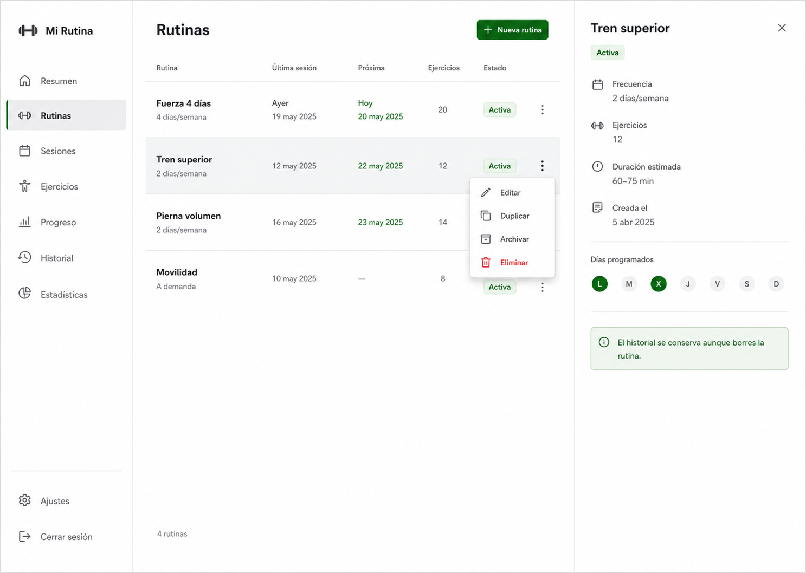

Lista de rutinas con menu contextual. El usuario abre acciones sobre una rutina. La pagina separa acciones normales de la accion destructiva y muestra contexto de la rutina seleccionada.

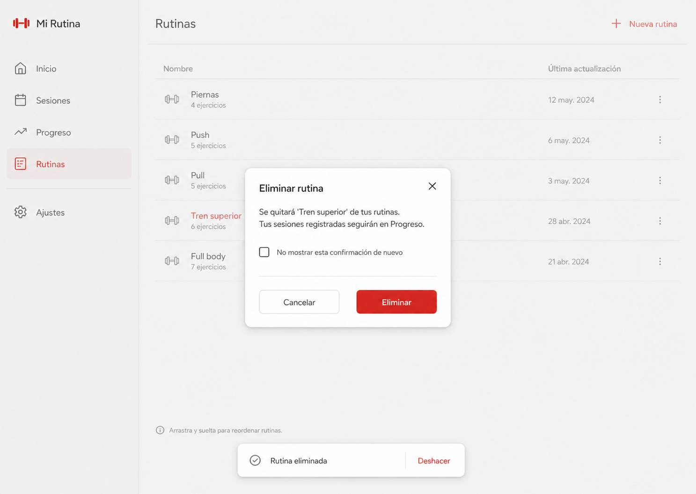

Confirmacion antes de eliminar. La pagina aclara que el historial de sesiones se conserva y ofrece deshacer despues de borrar.

### Entrenar

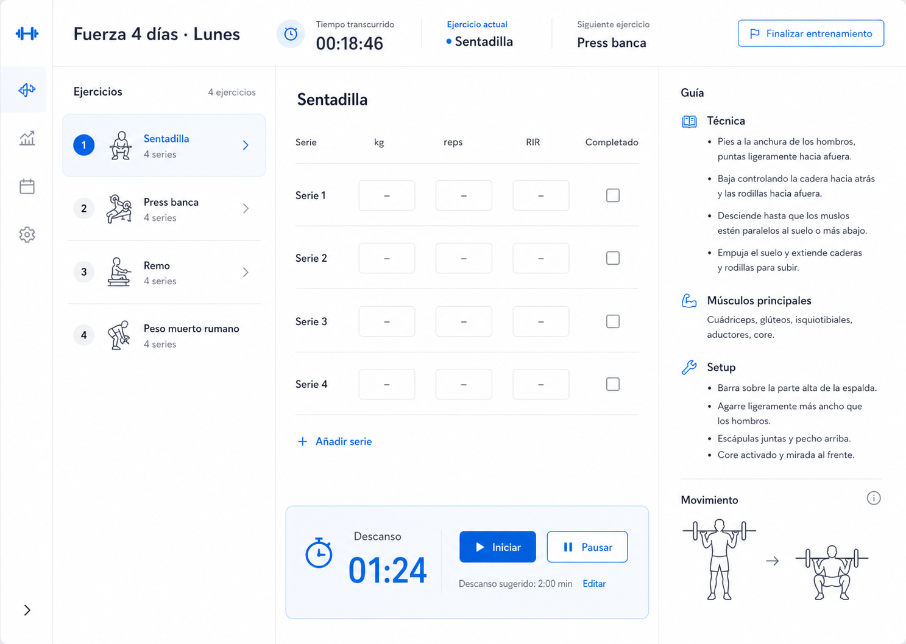

Sesion activa. El usuario registra peso, repeticiones y esfuerzo por serie. La pagina mantiene visibles la cola de ejercicios, el timer de descanso y la guia tecnica del ejercicio actual.

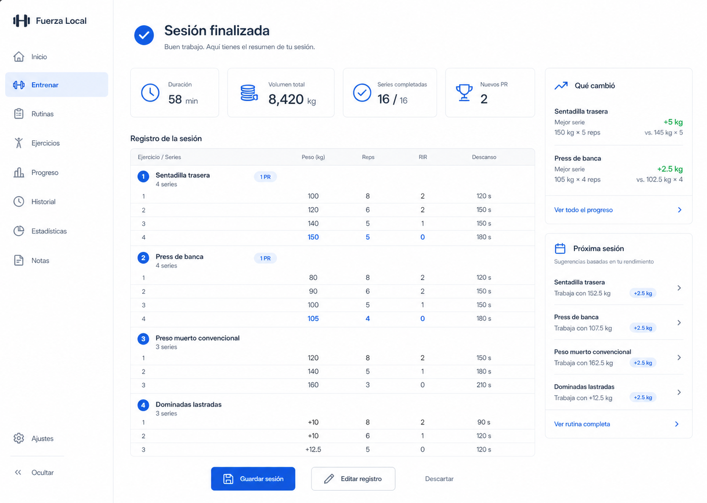

Resumen al terminar. La pagina muestra duracion, volumen, series completadas, marcas personales y sugerencias para la siguiente sesion antes de guardar.

### Ordenar rutinas

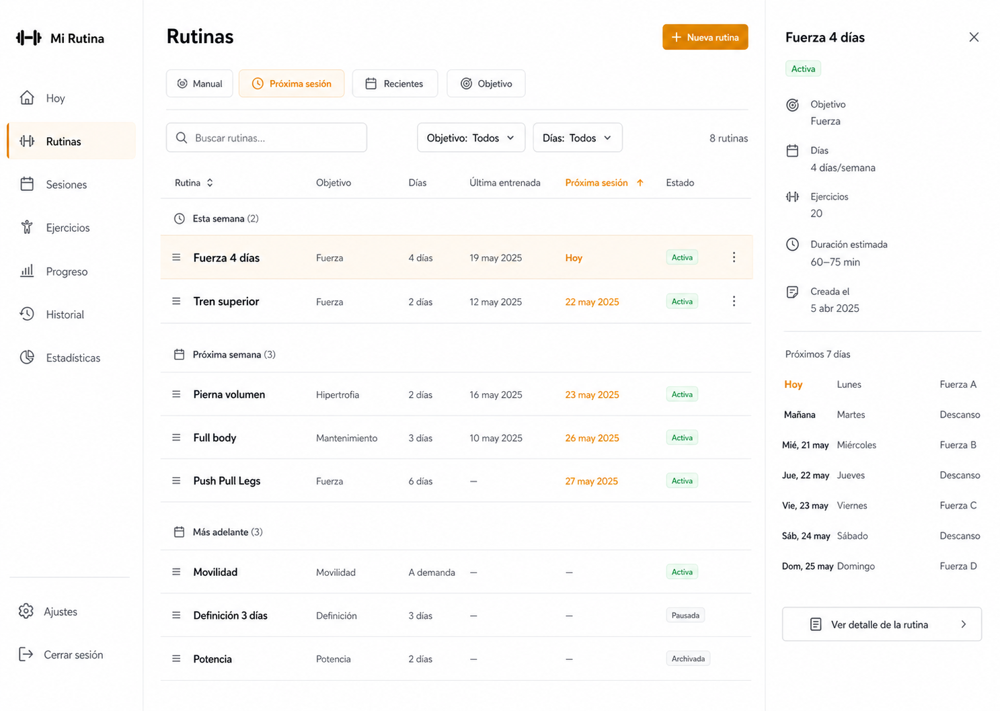

Ordenamiento por criterio. El usuario filtra o cambia el orden por proxima sesion, recientes, objetivo o manual. La pagina reordena la lista y conserva una vista previa de la rutina seleccionada.

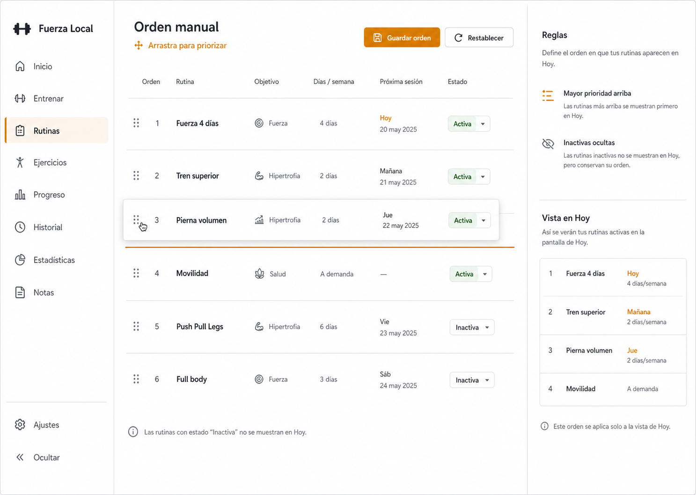

Modo de orden manual. El usuario arrastra rutinas para priorizarlas. La pagina muestra una linea de insercion, reglas del orden y una vista previa de como aparecera en Hoy.

### Ver analiticas

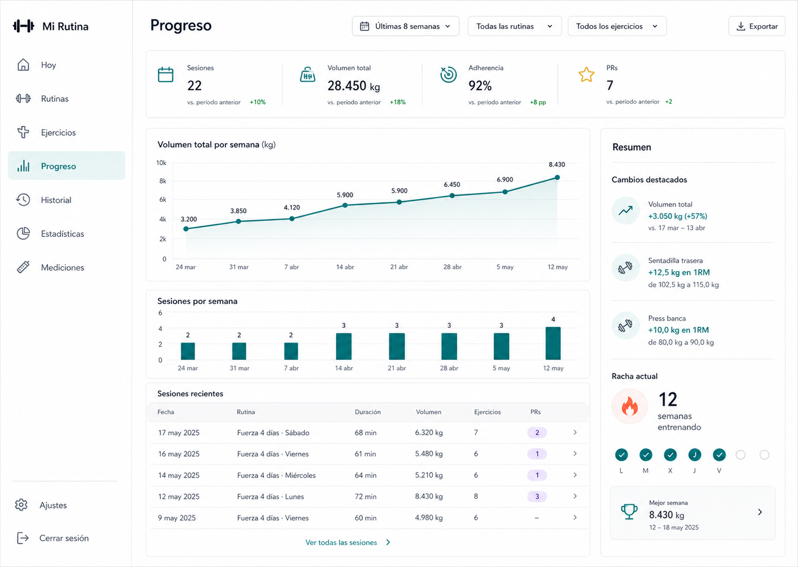

Dashboard general de progreso. El usuario cambia rango de fechas, rutina o ejercicio. La pagina muestra metricas clave, tendencia de volumen, sesiones por semana y sesiones recientes.

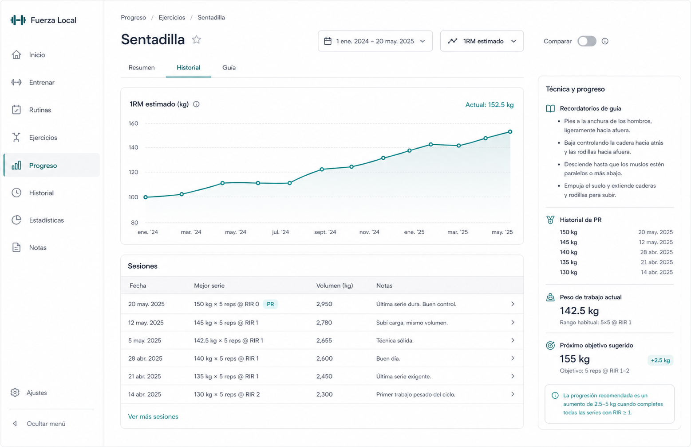

Detalle por ejercicio. El usuario revisa la evolucion de un movimiento especifico. La pagina muestra grafica de 1RM estimado, historial de sesiones, recordatorios tecnicos y sugerencia de proximo objetivo.
